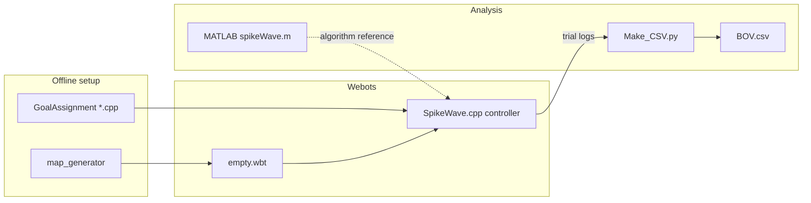

# Benefits of Varying Navigation Strategies in Teams of Robots

[](https://doi.org/10.1007/978-3-031-71533-4_5)

Research code and Webots simulation assets for:

> **Seyed Amirhosein Mohaddesi** (2024). *Benefits of Varying Navigation Strategies in Teams of Robots*. In: *Advances in Robotics Research*. Springer.  
> Chapter DOI: [10.1007/978-3-031-71533-4_5](https://doi.org/10.1007/978-3-031-71533-4_5)

The study asks how **heterogeneity in navigation strategies** within a multi-robot team affects mission time, coverage, and obstacle interactions, motivated by variability observed in human navigation.

**Status:** Research reproduction package — Webots simulation + MATLAB path-planning reference + Python aggregation of trial logs. CI runs Python unit tests only (no Webots in GitHub Actions).

[](https://www.youtube.com/watch?v=vQg6a5GYKL8)

## What this repository contains

| Area | Role |
|------|------|
| `PR2Maze/worlds/empty.wbt` | Webots world (PR2-based maze experiment). |
| `PR2Maze/controllers/SpikeWave/` | Main C++ supervisor controller (spiking wavefront pathfinding, logging). |
| `PR2Maze/controllers/GoalAssignment*.cpp` | Offline utilities to generate goal assignments for RT / SW / mixed populations. |
| `PR2Maze/controllers/map_generator/` | Map generation tool (build with Webots toolchain). |
| `spikeWave.m`, `mapLoader.m`, `topoWave.m` | MATLAB reference for spiking wavefront planning on grid maps. |
| `PR2Maze/controllers/SpikeWave/BOV.csv` | **Aggregated** trial metrics from the paper experiments (regenerated by `Make_CSV.py` when raw logs are present). |

Raw per-trial logs under `PR2Maze/controllers/SpikeWave/Results/` are **not** versioned (they are large and reproducible from simulation). Regenerate them by running Webots, then run the aggregation script (see below).

## Strategy conditions (summary)

1. **Route (RT)** — follow predefined routes.  
2. **Survey (SW)** — shortest-path style traversal with obstacle avoidance (spike-wave planner).  
3. **Mixed teams** — e.g. `0.4RT 0.6SW`, `0.6RT 0.4SW` population splits.  
4. **Human-inspired mix** — e.g. `0.9RT 0.1SW`.

Reported qualitative outcomes in the publication: SW tends to reduce mission time; RT tends to increase environment coverage; mixed policies trade off coverage and time; strategy variability can benefit team-level behavior (see paper for definitions and statistics).

## Architecture (high level)



- **Simulation:** Each robot runs the `SpikeWave` controller, which integrates lidar, odometry, and the spike-based planner, writes `outputLog*` and occupancy grids under a strategy-labeled results tree.  
- **Goal files:** `AssignedGoals*.txt`, `Sources.txt`, `Goals.txt`, and `RobotList.txt` in `PR2Maze/controllers/` configure starts and goals.  
- **Post-processing:** `Make_CSV.py` walks `Results/<strategy>/Result {1,3,5}/<trial>/`, parses logs, and writes `BOV.csv`.

## Requirements

- [Webots](https://cyberbotics.com/) **R2022b** or compatible (world file declares `VRML_SIM R2022b`; newer versions may work with migration).  
- C++17 toolchain available to Webots (GCC, Clang, or MSVC via Webots on Windows).  
- **Optional:** MATLAB, for `spikeWave.m` / `topoWave.m`.  
- **Optional:** Python 3.10+ with packages in `requirements.txt` (for tests and CSV aggregation).

Tested primarily on **Ubuntu 20.04**; Webots and the build system also support **Windows** and **macOS**.

## Quickstart

### 1. Clone

```bash
git clone https://github.com/AmirMohaddesi/Benefits-of-Varying-Navigation-Strategies-in-Robots.git
cd Benefits-of-Varying-Navigation-Strategies-in-Robots
```

### 2. Open the world in Webots

Open `PR2Maze/worlds/empty.wbt`. Ensure PROTO references resolve (Webots downloads EXTERNPROTO assets as needed).

### 3. Build and assign the controller

- Set each robot’s controller to `SpikeWave` (or your variant).  
- Build the controller from Webots (uses `PR2Maze/controllers/SpikeWave/Makefile` and `WEBOTS_HOME`).  
- Prepare goal assignments with the appropriate `GoalAssignment*.cpp` for your experiment (compile and run outside Webots, or use the pre-generated `AssignedGoals*.txt` in the repo).

### 4. Run the simulation

Press **Play** in Webots. Logs are written under `PR2Maze/controllers/SpikeWave/Results/<condition>/…` when that layout is used.

### 5. Regenerate `BOV.csv` (optional)

With a populated `Results/` tree and map file `edited map2.txt` next to the script:

```bash
pip install -r requirements.txt
cd PR2Maze/controllers/SpikeWave
python Make_CSV.py -v
```

Or from the repo root:

```bash
python PR2Maze/controllers/SpikeWave/Make_CSV.py --spike-dir PR2Maze/controllers/SpikeWave -v
```

### 6. Python tests

```bash
pip install -r requirements.txt
pytest tests/ -q
# or: make test
```

## Repository layout

```
.
├── PR2Maze/
│   ├── worlds/empty.wbt
│   ├── controllers/
│   │   ├── SpikeWave/          # Controller source, maps, BOV.csv, Make_CSV.py
│   │   ├── GoalAssignment*.cpp
│   │   ├── AssignedGoals*.txt, Sources.txt, Goals.txt, RobotList.txt
│   │   └── map_generator/
│   └── 5_Robots.mp4
├── spikeWave.m, mapLoader.m, topoWave.m
├── requirements.txt
├── tests/
├── Makefile
└── LICENSE
```

## Limitations

- Raw `Results/` logs are gitignored; clones contain **aggregated** `BOV.csv` unless you rerun simulations.  
- Reproducibility depends on Webots version, physics timestep, and build environment.  
- `GoalAssignmentRT.cpp` contains platform-specific shell calls (`del /Q`); use a Windows shell or adapt paths for Linux/macOS when regenerating assignments.  
- Mixed-strategy and human-inspired labels in folder names (e.g. `0.4RT 0.6SW results`) are experiment conventions from the original study.

## Roadmap / possible extensions

- Normalize goal-assignment utilities for cross-platform use.  
- Publish a Zenodo archive of raw `Results/` for bit-exact log reproduction.  
- Add a minimal Webots smoke test in CI if a headless Webots path becomes practical.

## Citation

```bibtex
@inproceedings{mohaddesi2024navigation,
  title     = {Benefits of Varying Navigation Strategies in Teams of Robots},
  author    = {Mohaddesi, Seyed Amirhosein},
  booktitle = {Advances in Robotics Research},
  year      = {2024},
  publisher = {Springer},
  doi       = {10.1007/978-3-031-71533-4_5}
}
```

## License

MIT — see [LICENSE](LICENSE).
