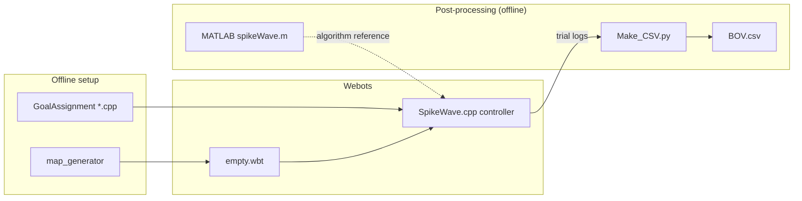

# Benefits of Varying Navigation Strategies in Teams of Robots

Webots multi-robot maze experiments comparing **route-following (RT)** versus **spike-wave survey (SW)** planning, **homogeneous** teams versus **mixed RT/SW** population fractions, with trial metrics aggregated into **`BOV.csv`**.

**Code ↔ paper:** This repo holds the **C++ Webots controller, world assets, and log layout** used to run the simulations reported in the Springer chapter below; **`BOV.csv` is produced offline by `Make_CSV.py`** from those logs. Interpretations, statistics, and any conditions not present in the committed spreadsheet belong in the **paper**, not the README.

[](https://doi.org/10.1007/978-3-031-71533-4_5) · **Demo:** [YouTube — simulation overview](https://www.youtube.com/watch?v=vQg6a5GYKL8)

[](https://www.youtube.com/watch?v=vQg6a5GYKL8)

> **Seyed Amirhosein Mohaddesi** (2024). *Benefits of Varying Navigation Strategies in Teams of Robots*. In: *Advances in Robotics Research*. Springer.  
> DOI: [10.1007/978-3-031-71533-4_5](https://doi.org/10.1007/978-3-031-71533-4_5)

**Status:** Research reproduction package — Webots + MATLAB spike-wave reference + Python aggregation; CI exercises Python tests only (no Webots in GitHub Actions).

## Research Contribution

- **Problem:** Quantify how **team-level navigation behavior** changes when robots do not all use the same planning style in a shared maze (mission time, coverage-style signals, and obstacle / interaction counts).
- **What “varying navigation strategies” means here:** Each robot is assigned a **Route (RT)** mode (path-following along predefined structure) or a **Survey (SW)** mode (spike-wave / shortest-path-style planning with obstacle avoidance); **mixed teams** fix a population fraction of RT vs SW (e.g. 40%/60%, 60%/40%) rather than everyone identical.
- **Versus baseline:** **Homogeneous** RT-only and SW-only teams are the clearest baselines; **heterogeneous** teams vary the RT/SW **population fraction** (e.g. 40/60, 60/40). The chapter also discusses other mixes (e.g. a high-RT, human-inspired split); **the committed `BOV.csv` columns list exactly which strategy families are in this aggregate** (four prefixes: `SW results`, `RT results`, `0.4RT 0.6SW results`, `0.6RT 0.4SW results`).
- **Observed pattern (qualitative):** In this study’s Webots setup, **SW-heavy teams tend to finish faster** on average while **RT-heavy patterns tend to show higher area-occupancy-style coverage**; **mixed splits fall between** the pure modes on these axes (see the chapter for definitions, statistics, and discussion).

## Results Snapshot


Bars are the **mean of all `Time taken (s)` cells** whose column names include **`5Robot`**, grouped by the **`BOV.csv` column prefix** (pure SW, two mixed fractions, pure RT). The metric is the **simulation-reported “time to visit all goals”** line from each robot’s `outputLog*.txt`. This is a **descriptive illustration** of the committed spreadsheet only, not a statistical result by itself.

## Reproducibility Note

- **Full per-trial trees** under `PR2Maze/controllers/SpikeWave/Results/<condition>/…` are **not committed** (large; produced by Webots; that path is **gitignored** once created). A normal clone still includes **`BOV.csv`** plus a few **small sample** `outputLog*.txt` files next to the controller for sanity checks—not a complete raw archive.
- **Regenerate logs:** Run Webots as in **Quickstart** to populate `Results/…` when you need full reruns.
- **Regenerate `BOV.csv`:** After logs exist, run `Make_CSV.py` (Quickstart, step 5). By default this overwrites `BOV.csv` beside the script; use `--output` to write elsewhere.
- **Optional archive:** No separate download of raw logs is linked yet; a Zenodo (or similar) bundle could be added later without changing the code layout.

## What this repository contains

| Area | Role |
|------|------|
| `PR2Maze/worlds/empty.wbt` | Webots world (PR2-based maze experiment). |
| `PR2Maze/controllers/SpikeWave/` | Main C++ supervisor controller (spiking wavefront pathfinding, logging). |
| `PR2Maze/controllers/GoalAssignment*.cpp` | Offline utilities to generate goal assignments for RT / SW / mixed populations. |
| `PR2Maze/controllers/map_generator/` | Map generation tool (build with Webots toolchain). |
| `spikeWave.m`, `mapLoader.m`, `topoWave.m` | MATLAB reference for spiking wavefront planning on grid maps. |
| `PR2Maze/controllers/SpikeWave/BOV.csv` | **Aggregated** trial metrics from the paper experiments (regenerated by `Make_CSV.py` when raw logs are present). |
| `PR2Maze/controllers/SpikeWave/Benefits of varying navigation strategies in robots.xlsx` | Optional spreadsheet companion (same study; not used by `Make_CSV.py`). |
| `figures/bov-mean-time-5robot.svg` | README snapshot figure derived from `BOV.csv` (see **Results Snapshot**). |

## Strategy conditions (summary)

1. **Route (RT)** — follow predefined routes.  
2. **Survey (SW)** — shortest-path style traversal with obstacle avoidance (spike-wave planner).  
3. **Mixed teams** — e.g. `0.4RT 0.6SW`, `0.6RT 0.4SW` population splits.  
4. **Human-inspired mix** — e.g. `0.9RT 0.1SW` (see chapter; may require a matching `Results/` subtree and rerun of `Make_CSV.py` to appear in a fresh `BOV.csv`).

Reported qualitative outcomes in the publication: SW tends to reduce mission time; RT tends to increase environment coverage; mixed policies trade off coverage and time; strategy variability can benefit team-level behavior (see paper for definitions and statistics).

## Architecture (high level)



- **Simulation (C++ / Webots):** Each robot runs the `SpikeWave` controller (lidar, odometry, spike-based planner); it writes `outputLog*` and occupancy grids under a strategy-labeled `Results/` tree. **Python does not run in the loop** — it only aggregates completed logs.  
- **Goal files:** `AssignedGoals*.txt`, `Sources.txt`, `Goals.txt`, and `RobotList.txt` in `PR2Maze/controllers/` configure starts and goals.  
- **Post-processing (Python):** `Make_CSV.py` walks `Results/<strategy>/Result {1,3,5}/<trial>/`, parses logs, and writes `BOV.csv`.

## Requirements

- [Webots](https://cyberbotics.com/) **R2022b** or compatible (world file declares `VRML_SIM R2022b`; newer versions may work with migration).  
- C++17 toolchain available to Webots (GCC, Clang, or MSVC via Webots on Windows).  
- **Optional:** MATLAB, for `spikeWave.m` / `topoWave.m`.  
- **Optional:** Python 3.10+ with packages in `requirements.txt` (for tests and CSV aggregation).

Tested primarily on **Ubuntu 20.04**; Webots and the build system also support **Windows** and **macOS**.

## Quickstart

### 1. Clone

```bash
git clone https://github.com/AmirMohaddesi/Benefits-of-Varying-Navigation-Strategies-in-Robots.git
cd Benefits-of-Varying-Navigation-Strategies-in-Robots
```

### 2. Open the world in Webots

Open `PR2Maze/worlds/empty.wbt`. Ensure PROTO references resolve (Webots downloads EXTERNPROTO assets as needed).

### 3. Build and assign the controller

- Set each robot’s controller to `SpikeWave` (or your variant).  
- Build the controller from Webots (uses `PR2Maze/controllers/SpikeWave/Makefile` and `WEBOTS_HOME`).  
- Prepare goal assignments with the appropriate `GoalAssignment*.cpp` for your experiment (compile and run outside Webots, or use the pre-generated `AssignedGoals*.txt` in the repo).

### 4. Run the simulation

Press **Play** in Webots. Logs are written under `PR2Maze/controllers/SpikeWave/Results/<condition>/…` when that layout is used.

### 5. Regenerate `BOV.csv` (optional)

With a populated `Results/` tree and map file `edited map2.txt` next to the script:

```bash
pip install -r requirements.txt
cd PR2Maze/controllers/SpikeWave
python Make_CSV.py -v
```

Or from the repo root:

```bash
python PR2Maze/controllers/SpikeWave/Make_CSV.py --spike-dir PR2Maze/controllers/SpikeWave -v
```

Custom output path (keeps the committed `BOV.csv` untouched for comparison):

```bash
python PR2Maze/controllers/SpikeWave/Make_CSV.py --spike-dir PR2Maze/controllers/SpikeWave --output PR2Maze/controllers/SpikeWave/BOV.regenerated.csv -v
```

### 6. Python tests

```bash
pip install -r requirements.txt
pytest tests/ -q
# or: make test
```

## Repository layout

```
.
├── PR2Maze/
│   ├── worlds/empty.wbt
│   ├── controllers/
│   │   ├── SpikeWave/          # Controller source, maps, BOV.csv, Make_CSV.py
│   │   ├── GoalAssignment*.cpp
│   │   ├── AssignedGoals*.txt, Sources.txt, Goals.txt, RobotList.txt
│   │   └── map_generator/
│   └── 5_Robots.mp4
├── spikeWave.m, mapLoader.m, topoWave.m
├── figures/                    # e.g. bov-mean-time-5robot.svg
├── requirements.txt
├── tests/
├── Makefile
└── LICENSE
```

## Limitations

- See **Reproducibility Note** — clones ship **aggregated** `BOV.csv`, not raw logs, unless you rerun simulations.  
- Reproducibility depends on Webots version, physics timestep, and build environment.  
- `GoalAssignmentRT.cpp` contains platform-specific shell calls (`del /Q`); use a Windows shell or adapt paths for Linux/macOS when regenerating assignments.  
- Mixed-strategy and human-inspired labels in folder names (e.g. `0.4RT 0.6SW results`) are experiment conventions from the original study.

## Roadmap / possible extensions

- Normalize goal-assignment utilities for cross-platform use.  
- Publish a Zenodo archive of raw `Results/` for bit-exact log reproduction.  
- Add a minimal Webots smoke test in CI if a headless Webots path becomes practical.

## Citation

```bibtex
@inproceedings{mohaddesi2024navigation,
  title     = {Benefits of Varying Navigation Strategies in Teams of Robots},
  author    = {Mohaddesi, Seyed Amirhosein},
  booktitle = {Advances in Robotics Research},
  year      = {2024},
  publisher = {Springer},
  doi       = {10.1007/978-3-031-71533-4_5}
}
```

## License

MIT — see [LICENSE](LICENSE).
